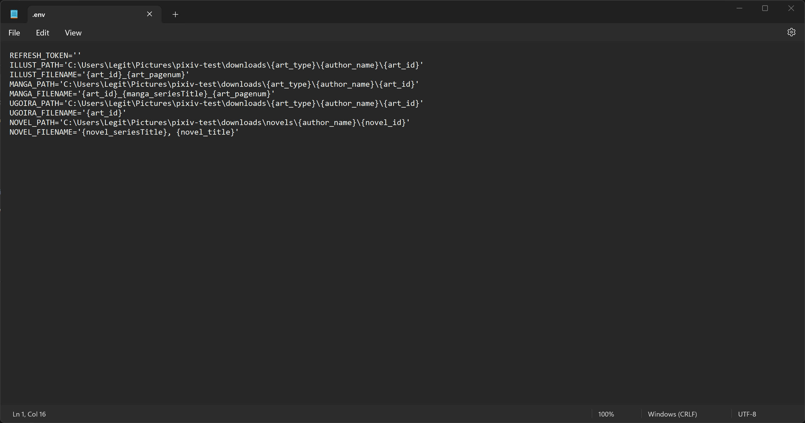

# Overview
Makes the downloading of illustrations, manga, ugoira, and novels from Pixiv easy.
    
## Description 
_Pixiv Downloader_ is built on [pixivpy](https://github.com/upbit/pixivpy)'s api by [upbit](https://github.com/upbit).
It is text-menu based and will be the backbone for a future GUI release. 
Major features include:
* Downloading all types artwork from Pixiv: Illustrations, Manga, and Ugoira (as .GIF)
* Supports downloading of novels (as TXT files)
* Custom download locations 
* Custom file names

## Usage 
For *official* releases, just go to the most recent release, download the zip file, and run the executable inside of it. Upon your first time running the program, it will ask you to enter your Pixiv refresh token. 
```
No Refresh Token loaded. Please put refresh token into .env.
Refresh Token: 
```

For using the source code, it is just as simple as installing the required python packages via pip and running main. 

```
pip install -r requirements.txt
```

Note:  To obtain your refresh token, follow ZipFile's [guide](https://gist.github.com/ZipFile/c9ebedb224406f4f11845ab700124362). This guide will require you to have python installed.

## Custom Naming Guide
Having custom file names and download paths is one of the major features of this program. Illustrations, manga, ugoira, and novels have their own custom names and paths each. If you plan to download a variety of artwork, remember to set them all up individually to the custom name and location of your liking.

### Custom Keywords
Both artwork and novels have their own set of unique keywords that allow them to have custom names. 

| Artwork Keywords| Manga Specific Keywords | Novel Keywords    | Universal Keywords
| :--------------:| :--:                    | :-:               | :-:
| art_id          | manga_seriesTitle       | novel_id          | author_id
| art_type        | manga_seriesID          | novel_title       | author_name
| art_title       |                         | novel_seriesTitle |
| art_pagecount   |                         | novel_seriesID    |
| art_pagenum     |                         |

>**Note**: All illustrations, manga, and ugoira can use any of the artwork keywords, however only manga have series, so using the series keyword for other artwork will just say "No series" in place of it. 

To activate keywords in your file names and paths, surround the keyword with {}. For example if I want to use the title of the art, I would do {art_title}. Do not put spaces like { art_title }, or any other characters in the brackets or else the program will read them as plain text.

### Custom Paths
1. Get absolute location you wish to store your specific type of artwork/novel at. To get this, go to the location in the file explorer, click on the current path, and copy it.


2. Inside the program, launch it, put in your refresh token if you have not already, go to settings, go into the specific type of artwork or novel you are wanting to customize, go into path, paste the absolute path you copied, but do not enter. 


3. Now enter in your keywords. Folders are seperated by \\'s. For my example, I want my files to be in a downloads folder, seperated by type of artwork, the artist's name, then the artwork's ID. After Entering that I will hit enter to confirm.

>**Note**: The characters: **\ / : * ? \ " < > |** are not allowed to be folder or file names in windows, setting them as folder or file names will cause the program to not function correctly.

### Custom Names
1. Inside the program, launch it, put in your refresh token if you have no already, go to settings, go into the specific type of artwork or novel you are wanting to customize, then go into filename.

2. Now enter your keywords. I want my illustrations to formatted with the illustration's ID and then the page number. Page number is a highly recommended always using art_pagenum.

>**Note**: The characters: **\ / : * ? \ " < > |** are not allowed to be folder or file names in windows, setting them as folder or file names will cause the program to not function correctly.

### .env file
The env file in the program's directory holds all this information and your refresh token. You can bypass going through the menus and enter it straight here if you wish. Here is my complete .env file with full customization. My refresh token has been removed since it is associated with my account. 

>**Note**: Make sure that the custom paths and filnames are inside the single quotes/apostrophes. Everything left of the equals sign and outside of the apostrophes should be exactly like this. 
